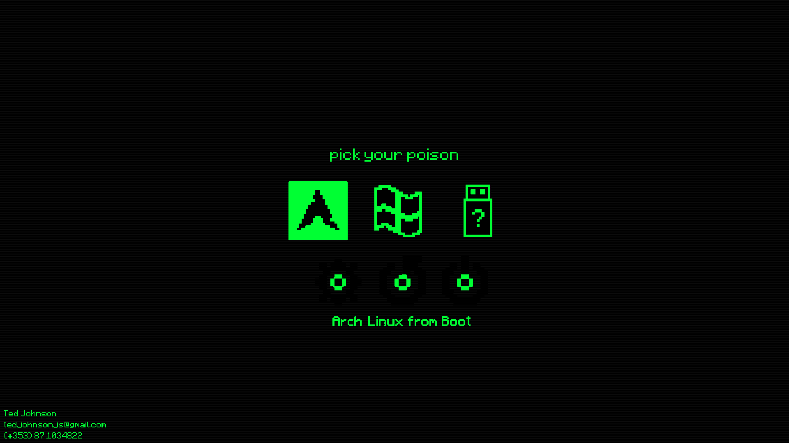

My personal [rEFInd](https://www.rodsbooks.com/refind/) bootloader configuration and resource files.

### Installation

[Install rEFInd](https://www.rodsbooks.com/refind/installing.html) as you would normally.

Replace the default configuration files with the ones provided here.
These files are probably located somewhere in your boot partition like `/EFI/refind/`

The files you need to replace/add are [background.png](./background.png), [font.png](./font.png), [refind.conf](./refind.conf), [selection_small.png](./selection_small.png) and [selection_big.png](./selection_big.png).

You will also want to replace the `icons` directory if with the ones here if you want the custom icons.

This configuration is specific to my machine, so if you want to use this yourself remember to change [refind.conf](./refind.conf) to match your system.
Specifically, you will need to change the OS stanzas as they are hard-coded to locate my installed operating systems on my hard drives.

You'll also want to edit the [background image](./background.png) as that has my own contact details on it.
